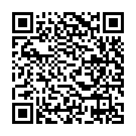
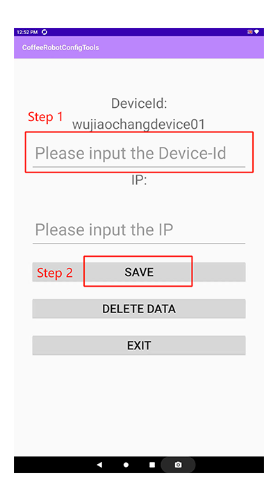

## Coffee Robot Kiosk App Installation Guide

### 1. There are 2 APPs need to be installed to the kiosk:
- Kiosk APP: This app is used by users for ordering, placing orders, and making payments.
- Kiosk config APP: This app is used for configurating the Coffee Robot Device IMEI (If you do not know the device IMEI, please contact customer service).

### 2. Install the Kiosk Config App: [kiosk_config_1.0.0.202306051328.apk](https://raw.githubusercontent.com/HestiaTeam/Docs/main/Kiosk/Files/config_1.0.0.202306051328.apk)

- If the download link is hard to input to kiosk browser, you also can do it like this:
- Open the browser in kiosk, then click the address bar (Set input focus to the browser address bar).
- Then scan the following qrcode, the download link will be automatically inputted into the browser address bar.

#### 2.1 Once the download is complete, install the config app directly onto the kiosk.
#### 2.2 Open the config app after installation, input the device IMEI (Step1), click Save button (Step2), then exit this app.

### 3. Install the Kiosk App: : [kiosk_1.0.0.202308110931.apk](https://raw.githubusercontent.com/HestiaTeam/Docs/main/Kiosk/Files/1.0.0.202308110931.apk)

- If the download link is hard to input to kiosk browser, you also can do it like this:
- Open the browser in kiosk, then click the address bar (Set input focus to the browser address bar).
- Then scan the following qrcode, the download link will be automatically inputted into the browser address bar.

#### 3.1 Once the download is complete, install the app directly onto the kiosk. It will override the old version if an old version installed.
#### 3.2 Open the app after installation, then check if everything is running well. If yes, the installation was successful.
