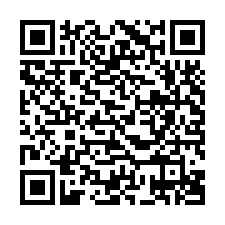

## Coffee Robot Kiosk App Lastest Updating Guide

#### 1. To update the kiosk app, download the latest version from this link: [kiosk_1.0.0.202308110931.apk](https://raw.githubusercontent.com/HestiaTeam/Docs/main/Kiosk/Files/app.1.0.0.202308110931.apk)

- If the download link is hard to input to kiosk browser, you also can do it like this:
- Open the browser in kiosk, then click the address bar (Set input focus to the browser address bar).
- Then scan the following qrcode, the download link will be automatically inputted into the browser address bar.

#### 2. Once the download is complete, install the app directly onto the kiosk. It will override the old version without requiring an uninstallation.
#### 3. Open the app after installation, then check if everything is running well. If yes, the update was successful.
